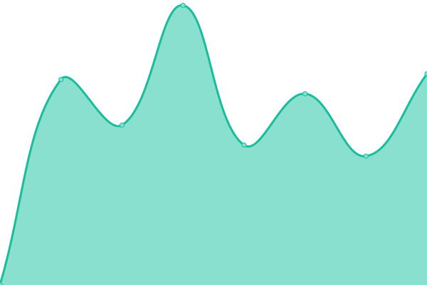
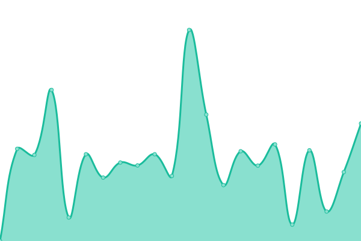

# [📈 Live Status](https://demo.upptime.js.org): <!--live status--> **🟧 Partial outage**

This repository contains the open-source uptime monitor and status page for [Upptime](https://upptime.js.org), powered by [Upptime](https://github.com/upptime/upptime).

With [Upptime](https://upptime.js.org), you can get your own unlimited and free uptime monitor and status page, powered entirely by a GitHub repository. We use [Issues](https://github.com/upptime/upptime/issues) as incident reports, [Actions](https://github.com/upptime/upptime/actions) as uptime monitors, and [Pages](https://demo.upptime.js.org) for the status page.

<!--start: status pages-->
<!-- This summary is generated by Upptime (https://github.com/upptime/upptime) -->
<!-- Do not edit this manually, your changes will be overwritten -->
<!-- prettier-ignore -->
| URL | Status | History | Response Time | Uptime |
| --- | ------ | ------- | ------------- | ------ |
|  [Vegas1kv](https://vegas1kv.com) | 🟩 Up | [vegas1kv.yml](https://github.com/ccris02/UpTime/commits/HEAD/history/vegas1kv.yml) | 

 137ms
     
 | 

<a href="https://upptime.github.io/upptime/history/vegas1kv">100.00%</a>
    

|  [Polkadir](https://polkadir.com) | 🟩 Up | [polkadir.yml](https://github.com/ccris02/UpTime/commits/HEAD/history/polkadir.yml) | 

 190ms
     
 | 

<a href="https://upptime.github.io/upptime/history/polkadir">100.00%</a>
    

|  [Polkadot.js](https://polkadot.js.org) | 🟩 Up | [polkadot-js.yml](https://github.com/ccris02/UpTime/commits/HEAD/history/polkadot-js.yml) | 

 110ms
     
 | 

<a href="https://upptime.github.io/upptime/history/polkadot-js">100.00%</a>
    

|  [Polkadot Telemetry](https://telemetry.polkadot.io) | 🟩 Up | [polkadot-telemetry.yml](https://github.com/ccris02/UpTime/commits/HEAD/history/polkadot-telemetry.yml) | 

 589ms
     
 | 

<a href="https://upptime.github.io/upptime/history/polkadot-telemetry">100.00%</a>
    

|  [doTreasury](https://www.dotreasury.com) | 🟩 Up | [do-treasury.yml](https://github.com/ccris02/UpTime/commits/HEAD/history/do-treasury.yml) | 

 193ms
     
 | 

<a href="https://upptime.github.io/upptime/history/do-treasury">100.00%</a>
    

|  [Polkassembly](https://polkadot.polkassembly.io) | 🟩 Up | [polkassembly.yml](https://github.com/ccris02/UpTime/commits/HEAD/history/polkassembly.yml) | 

 209ms
     
 | 

<a href="https://upptime.github.io/upptime/history/polkassembly">100.00%</a>
    

|  [PolkaProject](https://polkaproject.com) | 🟩 Up | [polka-project.yml](https://github.com/ccris02/UpTime/commits/HEAD/history/polka-project.yml) | 

 1136ms
     
 | 

<a href="https://upptime.github.io/upptime/history/polka-project">100.00%</a>
    

|  [DOTspot](https://www.dotspot.io/projects) | 🟩 Up | [do-tspot.yml](https://github.com/ccris02/UpTime/commits/HEAD/history/do-tspot.yml) | 

 409ms
     
 | 

<a href="https://upptime.github.io/upptime/history/do-tspot">100.00%</a>
    

|  [Parastats](https://parastats.io) | 🟩 Up | [parastats.yml](https://github.com/ccris02/UpTime/commits/HEAD/history/parastats.yml) | 

 507ms
     
 | 

<a href="https://upptime.github.io/upptime/history/parastats">100.00%</a>
    

|  [DOT Market Cap](https://dotmarketcap.com) | 🟩 Up | [dot-market-cap.yml](https://github.com/ccris02/UpTime/commits/HEAD/history/dot-market-cap.yml) | 

 1267ms
     
 | 

<a href="https://upptime.github.io/upptime/history/dot-market-cap">100.00%</a>
    

|  [Subscan](https://kusama.subscan.io) | 🟩 Up | [subscan.yml](https://github.com/ccris02/UpTime/commits/HEAD/history/subscan.yml) | 

 554ms
     
 | 

<a href="https://upptime.github.io/upptime/history/subscan">100.00%</a>
    

|  [sub.id](https://sub.id) | 🟩 Up | [sub-id.yml](https://github.com/ccris02/UpTime/commits/HEAD/history/sub-id.yml) | 

 180ms
     
 | 

<a href="https://upptime.github.io/upptime/history/sub-id">100.00%</a>
    

|  [DOTscanner](hhttps://dotscanner.com) | 🟥 Down | [do-tscanner.yml](https://github.com/ccris02/UpTime/commits/HEAD/history/do-tscanner.yml) | 

 0ms
     
 | 

<a href="https://upptime.github.io/upptime/history/do-tscanner">0.00%</a>
    

|  [Polkascan](https://polkascan.io/polkadot) | 🟩 Up | [polkascan.yml](https://github.com/ccris02/UpTime/commits/HEAD/history/polkascan.yml) | 

 570ms
     
 | 

<a href="https://upptime.github.io/upptime/history/polkascan">100.00%</a>
    

|  [Polkaview](https://polkaview.network/dot/staking) | 🟩 Up | [polkaview.yml](https://github.com/ccris02/UpTime/commits/HEAD/history/polkaview.yml) | 

 318ms
     
 | 

<a href="https://upptime.github.io/upptime/history/polkaview">100.00%</a>
    

|  [TurboFlakes](https://turboflakes.com) | 🟩 Up | [turbo-flakes.yml](https://github.com/ccris02/UpTime/commits/HEAD/history/turbo-flakes.yml) | 

 119ms
     
 | 

<a href="https://upptime.github.io/upptime/history/turbo-flakes">100.00%</a>
    

<!--end: status pages-->

[**Visit our status website →**](https://demo.upptime.js.org)

## 📄 License

- Powered by: [Upptime](https://github.com/upptime/upptime)
- Code: [MIT](./LICENSE) © [Upptime](https://upptime.js.org)
- Data in the `./history` directory: [Open Database License](https://opendatacommons.org/licenses/odbl/1-0/)
